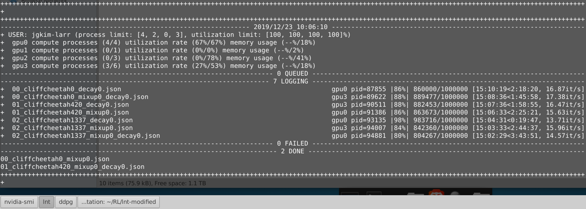

# Manage multiple NVIDIA GPU compute tasks

Supports per gpu compute process/utilization rate limits on a per-(UNIX)user basis, load-balancing and more.

Tested on tensorflow-gpu tasks.

   

Installation (virtual python environment such as venv/conda is recommended)
    
    cd /path/to/install
    git clone https://github.com/jigangkim/nvidia-gpu-scheduler.git
    cd /path/to/install/nvidia-gpu-scheduler

    pip install . # standard installation
    pip install -e . # editable (develop mode) installation
    
Usage (dummy example)
    
    cd /path/to/install/nvidia-gpu-scheduler
    python example.py # -h or --help to view arguments

Usage (OpenAI baselines example)
    
    cd /path/to/install/nvidia-gpu-scheduler
    python example_openaibaselines.py # -h or --help to view arguments
